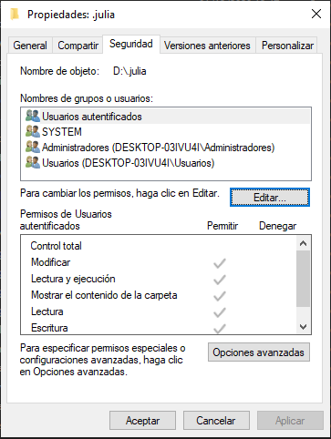
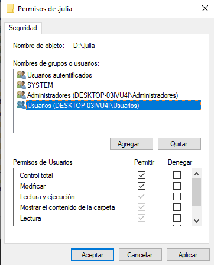

# Instalación

Aquí tenemos las instrucciones para instalar en nuestra máquina:

- Julia 
- nteract, un programa para visualizar, editar y ejecutar *Jupyter notebooks*
- Visual Studio Code, un IDE completo, que es perfecto para Julia

## Julia

1. Editar la variable de entorno `JULIA_DEPOT_PATH` para que decidamos dónde se instalarán todos los paquetes. Esto es independiente del lugar en donde se instala Julia y por eso hay que hacerlo antes.
	- Ejemplo: `JULIA_DEPOT_PATH=D:\.julia`
2. Descargar el ejecutable del **instalador** de Julia desde [https://julialang.org/](https://julialang.org/) e instalar **como administrador** (dar clic derecho en el instalador y seleccionar "Ejecutar como Administrador") la versión más reciente (1.6.2 al momento de hacer este escrito) en la ubicación deseada.
	- Ejemplo:  en `D:\Programas\Julia`

	
	
	**N.B.** Asegúrate de tener derechos de escritura en los directorios donde  se instala Julia. Para modificar los permisos, haz clic derecho en la carpeta designada para `JULIA_DEPOT_PATH` (por ejemplo, `D:\.julia`) luego en "Propiedades", luego en la pestaña "Seguridad":
	
	
	
	Dentro de esa pestaña, seleccionar "Usuarios" y en la sección inferior seleccionar el cuadro de `Control total` y dar "Aceptar".
	
	

3. ¡Listo!
4.  Abrir Julia 1.6.2 desde el menú de aplicaciones de Windows e instalar IJulia para poder utilizar nteract con *notebooks* de Julia. Para esto, ingresamos al gestor de paquetes tecleando `]` (nota que el *prompt* cambió de `julia> ` a `(@v1.5) pkg> `) y agregamos `IJulia` con el comando `add IJulia`.
	
	```julia
	julia> ]
	(@v1.5) pkg> add IJulia	
	```
	
	
## nteract

1. Descargar nteract desde la página [https://nteract.io/](https://nteract.io/)

	
	
2.  Hacer doble clic en el instalador y aceptar las advertencias de seguridad
3. Al ejecutar nteract, seleccionar el _runtime_ de Julia


## Visual Studio Code

1. Descargar VS Code desde [https://code.visualstudio.com/](https://code.visualstudio.com/)

	

2. Al instalar, seleccionar:
	- [ ] Agregar la acción "Abrir con Code" al menú contextual de archivo del Explorador de Windows
	- [ ] Agregar la acción "Abrir con Code" al menú contextual de directorio del Explorador de Windows
	- [ ] Agregar a PATH

1. Al abrir VS Code, ir a las configuraciones de VS Code (engrane -> *Settings*) y buscar en las Extensiones la de Julia y modificar:
	- `Julia: Executable Path` (hacia donde está el ejecutable de Julia) o añade Julia a la variable `PATH` del sistema
	- Julia > `Execution:Result Type` (a *both*)
