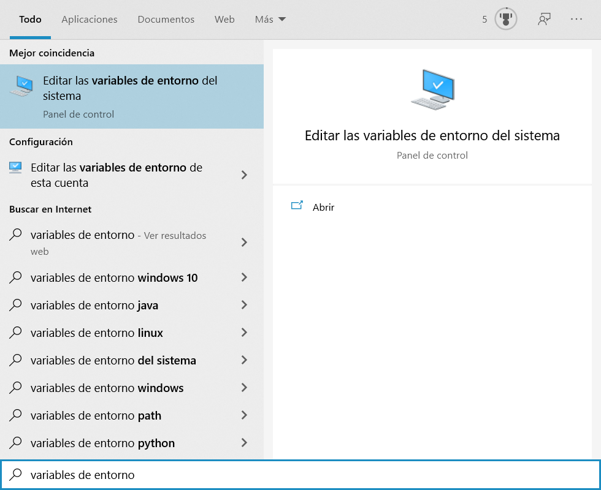
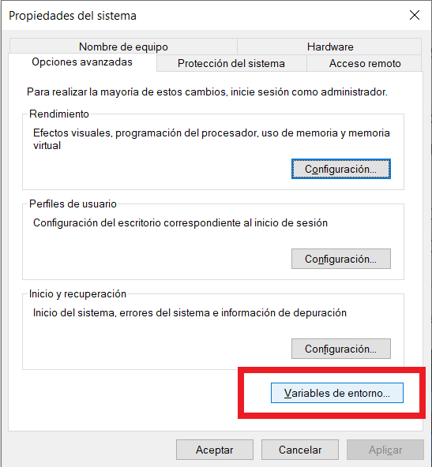
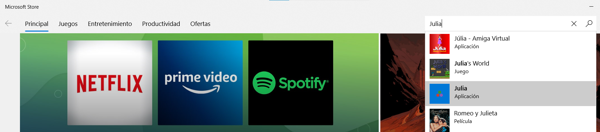
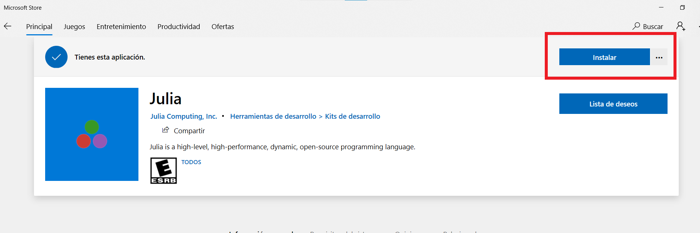
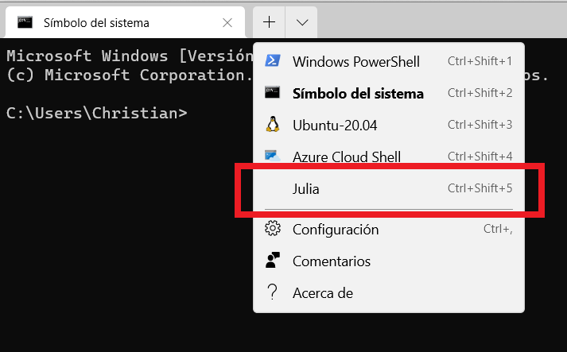
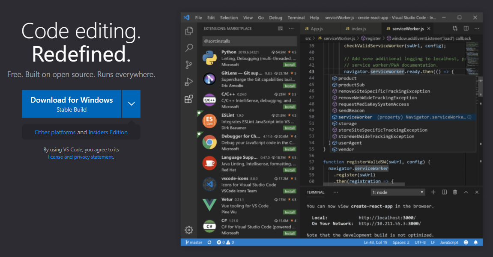

# Instalación

Aquí tenemos las instrucciones para instalar en nuestra máquina:

- [Julia](https://julialang.org/)
- [Pluto](https://github.com/fonsp/Pluto.jl) y [IJulia](https://julialang.github.io/IJulia.jl/stable/) los paquetes necesarios para trabajar con _notebooks_
- [Visual Studio Code](https://code.visualstudio.com/), un IDE completo perfecto para Julia

Como prerrequisitos para la instalación debes contar con suficiente espacio en el disco duro en el que quieres instalar Julia (para el taller, al menos unos 10 GiB).

El instalador en sí solo ocupa unos 80 MiB de espacio, pero el instalar paquetes adicionales, además de las compilaciones de los mismos, fácilmente nos lleva al orden de los 10 GiB.

## Cambiando la ubicación de instalación de paquetes de Julia (opcional)

La manera de indicarle a Julia que instale los paquetes en una ubicación de nuestra elección (por ejemplo, un segundo disco duro con mayor espacio) es crear una variable de entorno `JULIA_DEPOT_PATH` y asignarle la ruta en la que deseemos instalar los paquetes.

Como ya se mencionó, esto es independiente del lugar en donde se instala Julia y por eso hay que hacerlo **antes de la instalación**.

- Ejemplo: `JULIA_DEPOT_PATH=D:\.julia`

Una forma de hacer esto en Windows 10 es escribir `Variables de entorno` en el menú de inicio y seleccionar `Editar las variables de entorno del sistema`.

Luego, hacer clic en el botón `Variables de entorno...` en la parte inferior derecha.

En la parte inferior (variables del sistema), hacer clic en el botón `Nueva...`.

Crear una variable que se llame `JULIA_DEPOT_PATH` y seleccionar la carpeta en la que deseemos que se instalen TODOS los paquetes adicionales de Julia. Por ejemplo, en otro disco duro con mayor capacidad.

## Julia

Las instrucciones para instalar Julia para cada sistema operativo están en inglés en la [página de descargas](https://julialang.org/downloads/).

Vamos a dar más detalle para instalar en Windows ya que si usas Linux/Mac lo más probable es que estés más familiarizado con el uso de la terminal y no tengas problema siguiendo las instrucciones de la documentación.

Por el otro lado, en Windows hay ciertos detalles a cuidar. Tenemos dos opciones:

1. La más nueva y rápida (y versátil) desde la [Microsoft Store](https://www.youtube.com/watch?v=rFlbjWC6zYA) (sigue el enlace para ver la presentación en Juliacon 2021)

2. La descarga e instalación manual 

### 1. Desde la Microsoft Store

Esta forma se encarga de instalar un multiplexor de Julia, llamado [Juliaup](https://github.com/JuliaLang/juliaup), que permite actualizar Julia e incluso instalar distintas versiones en la misma computadora y cambiar entre ellas de forma sencilla.

1. Abre la Microsoft Store.

2. Escribe `Julia` en la barra de búsqueda y selecciona la aplicación.
	
	

2. Haz clic en el botón `Instalar`.

	

3. ¡Listo! Ahora puedes abrir la consola de Julia como cualquier otra aplicación. Aunque si tienes instalada la consola de Windows (recomendada y disponible en la Microsoft Store también), también aparecerá ahí.

	

### 2. Intalación manual

De esta forma, tendrás que manualmente instalar nuevas versiones de Julia conforme sean liberadas.

1. Descargar el ejecutable del **instalador** de Julia desde la [página de descargas](https://julialang.org/downloads/).

2. Instalar **como administrador** (dar clic derecho en el instalador y seleccionar "Ejecutar como Administrador") en la ubicación deseada.
	
	- Ejemplo:  en `D:\Programas\Julia`

	**N.B.** Asegúrate de tener derechos de escritura en los directorios donde  se instala Julia. Para modificar los permisos, haz clic derecho en la carpeta designada para `JULIA_DEPOT_PATH` (por ejemplo, `D:\.julia`) luego en "Propiedades", luego en la pestaña "Seguridad":
	
	
	
	Dentro de esa pestaña, seleccionar "Usuarios" y en la sección inferior seleccionar el cuadro de `Control total` y dar "Aceptar".
	
	

3. ¡Listo! Ahora puedes abrir la consola de Julia como cualquier otra aplicación. Aunque si tienes instalada la consola de Windows (recomendada y disponible en la Microsoft Store también), también aparecerá ahí.

	

## Pluto y IJulia

## Visual Studio Code

1. Descargar VS Code desde [https://code.visualstudio.com/](https://code.visualstudio.com/)

	

2. Al instalar, seleccionar:
	- [X] Agregar la acción "Abrir con Code" al menú contextual de archivo del Explorador de Windows
	- [X] Agregar la acción "Abrir con Code" al menú contextual de directorio del Explorador de Windows
	- [X] Agregar a PATH

2. Al abrir VS Code, ir a las configuraciones de VS Code (engrane -> *Settings*) y buscar en las Extensiones la de Julia y modificar:
	- `Julia: Executable Path` (hacia donde está el ejecutable de Julia) o añade Julia a la variable `PATH` del sistema
	- Julia > `Execution:Result Type` (a *both*)
