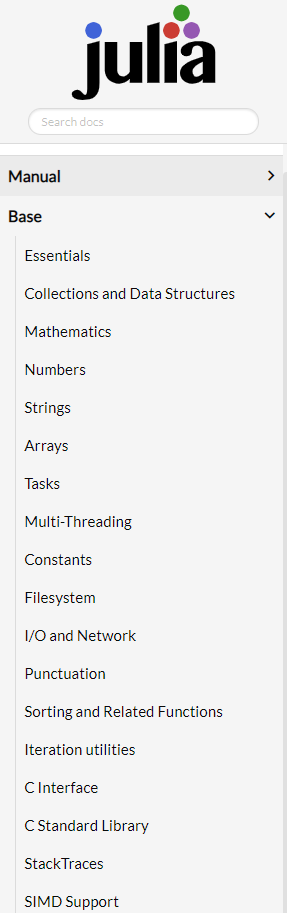
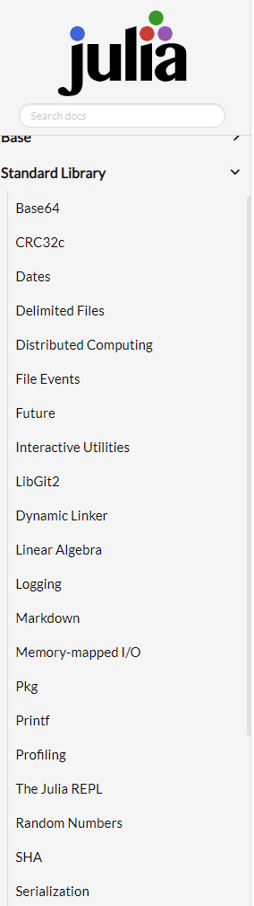

# Julia con "pilas incluidas"

[Regresar](./README.md)

---

Decimos que Julia viene con pilas incluidas porque al instalar Julia ya tenemos una enorme funcionalidad a nuestro alcance.
 
## Base

El módulo principal que siempre está disponible desde que Julia arranca se llama `Base`.  Este módulo es el que nos permite tener disponibles funciones como `print()`, `println`, `pop!()`, `push!`, y también constantes y funciones matemáticas como `sum()`, $\pi$, $\sin()$, etc.

Ver la [documentación](https://docs.julialang.org/).

En la imagen de la documentación podemos ver que el módulo `Base` ya tiene funcionalidad para matemáticas como mencionamos, pero también para cadenas (por ejemplo, Julia cuenta con soporte nativo para expresiones regulares), entradas y salidas y redes, para cómputo paralelo y para el sistema de archivos (por ejemplo, funciones para cambiar el directorio de trabajo, para crear una carpeta, copiar un archivo o descargar un archivo desde una URL).

## Standard Library

La biblioteca estándar, por el otro lado, **también** viene incluida con Julia, pero sus funciones no están disponibles desde el arranque. Es necesario importar el módulo que necesitemos.

Como podemos ver en la imagen de la documentación de la biblioteca estándar tenemos paquetes o módulos para manejar fechas, álgebra lineal, números aleatorios, el gestor de paquetes (`Pkg`), estadística, manejo de arreglos dispersos (*sparse arrays*), etc. Nuevamente, recomiendo dar un vistazo a la documentación.

---

[Regresar](./README.md)