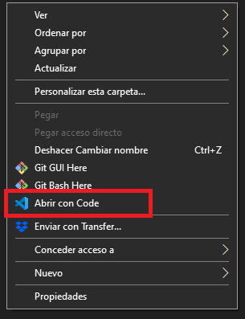
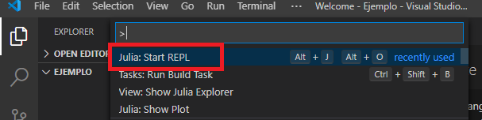
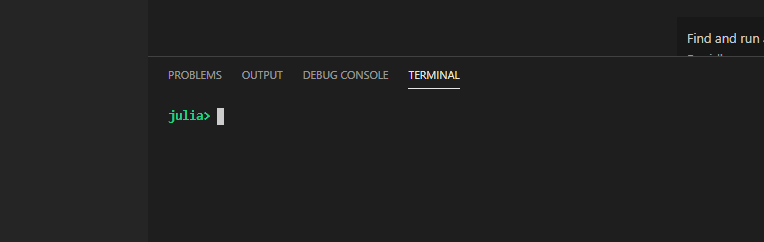
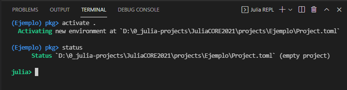
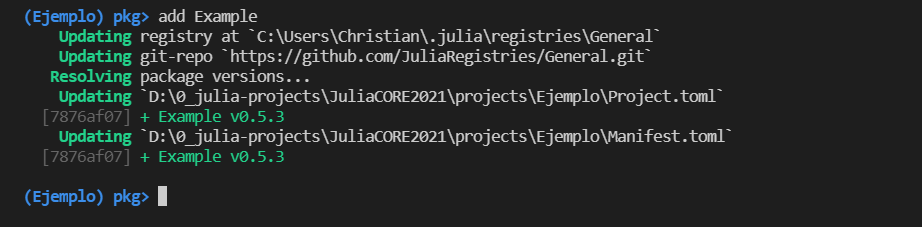
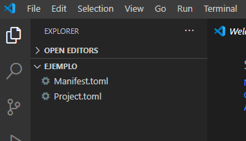
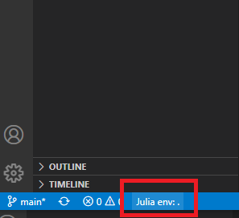
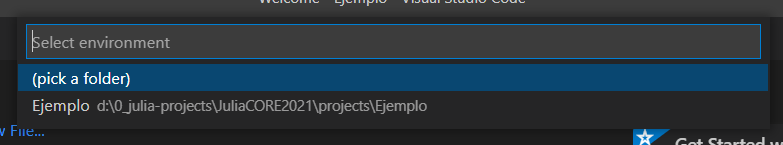
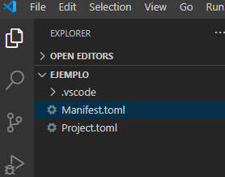
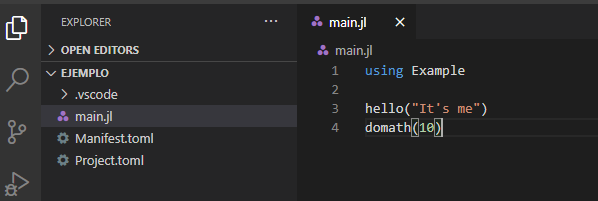

# Ambientes de desarrollo

[Regresar](./README.md)

---

Julia permite tener ambientes de trabajo completamente independientes.

## Crear un ambiente desde cero

1. Creemos una carpeta nueva con el nombre `Ejemplo`.

2. Dentro de la carpeta, hagamos clic derecho y seleccionemos `Abrir con code`:

    

3. En VS Code, abramos la paleta de comandos (`ctrl` + `shift` + `P` ) y seleccionemos `Julia: Start REPL`.

    

    Nos abrirá una terminal de Julia en la parte inferior:

    

4. En esa terminal, ingresemos al gestor de paquetes tecleando `]`.

5. Activemos este ambiente, que está vacío por el momento, con el comando `activate .`

    

6. En este ambiente vacío, agreguemos los paquetes que necesitemos en este nuevo ambiente. Por ejemplo, agreguemos el paquete `Example` con el comando `add Example`.

    

    Después de un tiempo, Julia habrá descargado el paquete [`Example.jl`](https://github.com/JuliaLang/Example.jl), que está en GitHub, y habrá creado los archivos `Project.toml` y `Manifest.toml` en nuestro directorio `Ejemplo` que definen este ambiente y sus dependencias.

    

7. Por último, solo necesitamos indicarle a VS Code qué ambiente es el que queremos que use. Para esto hagamos clic en la barra inferior donde dice `Julia env:`. Nos abrirá un menú en la parte superior donde podemos seleccionar el ambiente actual.

    
    

    Después de seleccionar un ambiente, VS Code crea una carpeta `.vscode` en el directorio que guarda la configuración de VS Code para esta carpeta.

    

Ahora, podemos crear un *script* de Julia y usar el paquete que acabamos de agregar a nuestro proyecto.

## Reproducir un ambiente

La ventaja de que todo el ambiente esté completamente determinado por los archivos TOML es que podemos compartir nuestro trabajo y de esta forma reproducir exactamente nuestros resultados. Ser capaces de compartir y reproducir nuestro trabajo es **fundamental** en el cómputo científico y Julia lo hace muy sencillo.

Supongamos que alguien nos comparte una carpeta con estos dos archivos. 

1. Abramos VS Code en ese directorio con el mismo procedimiento de hacer clic derecho y seleccionar `Abrir con Code`.

2. En VS Code abrimos una sesión del REPL de Julia y veremos, al abrir el gestor de paquetes con `]`, que el ambiente ya está reconocido.

3. Si usamos el comando `status`, Julia nos indicará qué paquetes son necesarios descargar. 

4. Para descargarlos, tecleamos el comando `instantiate`. Después de un tiempo Julia habrá descargado los paquetes y estamos listos para ejecutar los *scripts* de esa carpeta que hagan uso de los paquetes del ambiente.

---

[Regresar](./README.md)