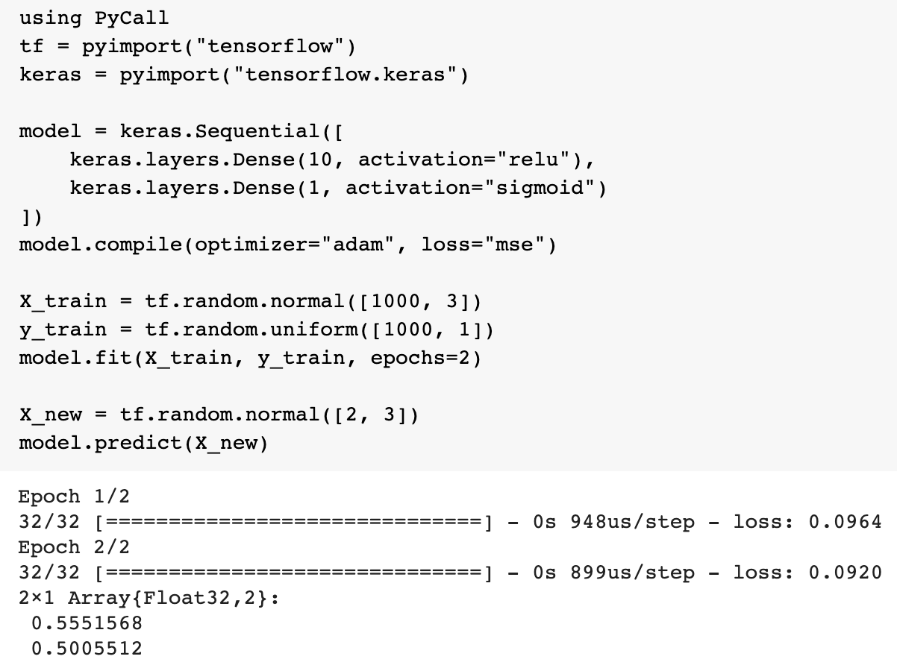

# Cómo correr TensorFlow en Julia

Aurélien Geron [tuiteó](https://twitter.com/aureliengeron/status/1277751121440698368/photo/1) un ejemplo usando TensorFlow en 100 % Julia:

<iframe border=0 frameborder=0 height=250 width=550
 src="https%3A%2F%2Ftwitter.com%2Faureliengeron%2Fstatus%2F1277751121440698368"></iframe>

<blockquote class="twitter-tweet"><p lang="en" dir="ltr">This is 100% <a href="https://twitter.com/hashtag/JuliaLang?src=hash&amp;ref_src=twsrc%5Etfw">#JuliaLang</a> code. It trains a dense neural network using the <a href="https://twitter.com/hashtag/Keras?src=hash&amp;ref_src=twsrc%5Etfw">#Keras</a> Python library. If you replace the first 3 lines with &quot;import tensorflow as tf; from tensorflow import keras&quot;, you can run the exact same code in Python. Talk about excellent interoperability! 🤝 <a href="https://t.co/Umf7zL6uAU">pic.twitter.com/Umf7zL6uAU</a></p>&mdash; Aurélien Geron (@aureliengeron) <a href="https://twitter.com/aureliengeron/status/1277751121440698368?ref_src=twsrc%5Etfw">June 29, 2020</a></blockquote> <script async src="https://platform.twitter.com/widgets.js" charset="utf-8"></script>



Antes de poder hacer eso, necesitamos agregar `PyCall` y `Conda` a nuestro ambiente de Julia. Al momento de escribir estas notas, al agregar `PyCall` a Julia, se instala miniconda con Python 3.9. TensorFlow sí está probado con Python 3.9 así que no es necesario cambiar la versión de Python que instala `PyCall`. Podemos agregar `tensorflow` desde el canal de `intel` ya que hay un [problema](https://github.com/tensorflow/tensorflow/issues/24172?s=08) con cuántos núcleos de CPU usa TensorFlow.

```julia
julia> ]
pkg> add PyCall Conda
julia> import Conda
julia> Conda.add("tensorflow", channel="intel")  # Para que tensorflow utilice todos los CPU
```

Si quisieras cambiar la versión de Python por defecto, se puede agregar con `Conda`:

```julia
julia> import Conda
julia> Conda.add("python=3.8")
```
Pero es necesario volver a construir (_build_) `PyCall`:

```julia
julia> ]
pkg> build PyCall
```

**NOTA:** PyCall [NO soporta](https://github.com/JuliaPy/Conda.jl) el uso de ambientes de Conda y por eso instalamos en el ambiente raíz.

